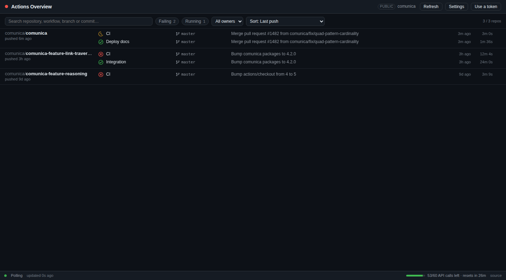
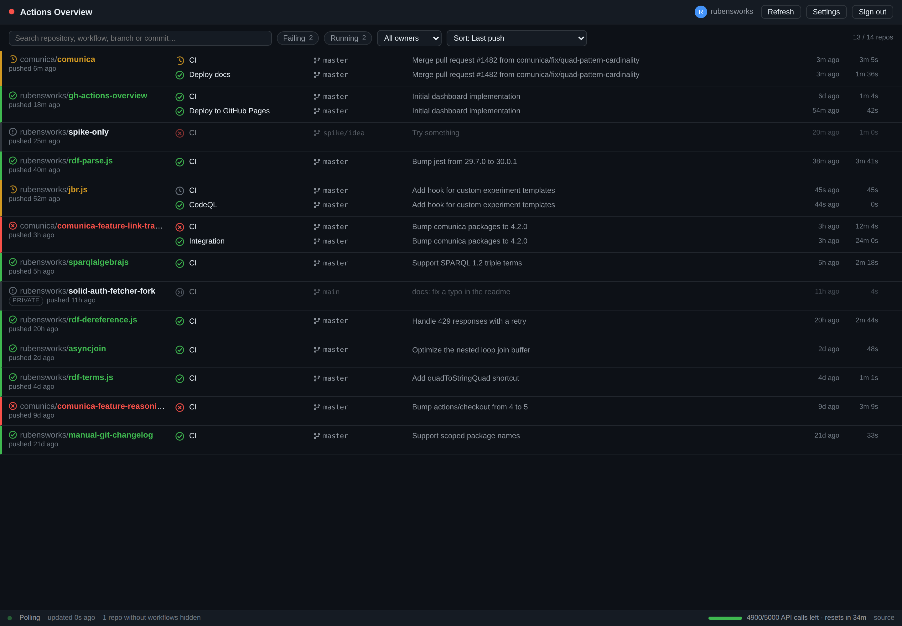
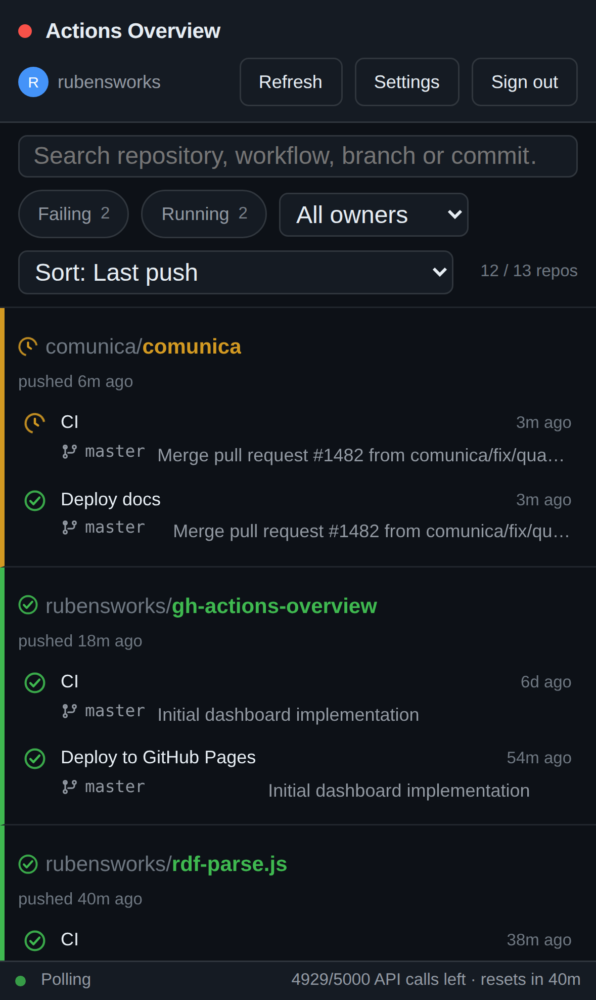

# GitHub Actions Overview

[](https://github.com/rubensworks/gh-actions-overview/actions?query=workflow%3ACI)
[](https://coveralls.io/github/rubensworks/gh-actions-overview?branch=master)
[](https://opensource.org/licenses/MIT)

A dashboard for all your GitHub Actions, in the spirit of the old Travis CI overview: one dense row
per repository, the latest run of every workflow, and red where it hurts.

**[→ Open the dashboard](https://rubensworks.github.io/gh-actions-overview/)** ·
**[→ Try it without a token](https://rubensworks.github.io/gh-actions-overview/#owner=comunica)**


It is a static page. There is no backend, no analytics, and no third-party host: the only server
this app ever talks to is `api.github.com`, straight from your browser.

## Features

- **One row per repository** with the state of each workflow: status icon, branch, commit
  message, relative time, duration, and a deep link to the run on github.com.
- **The default branch is the status.** Each workflow reports its newest run on the repository's
  default branch, however long ago that was. A red feature branch never displaces a green `master`,
  and the failure count and the favicon follow the same rule.
- **A status rule down the margin**, in the spirit of the Travis overview: every row carries a
  green, red or yellow line on its left edge, its name in the same colour, and a tick, cross or
  spinner in front of it. The state of a long list reads straight down the left-hand side.
- **Sorting** by last push, last commit on the default branch, last workflow run, last
  default-branch run, failures first, stars, or name — part of the URL fragment like every other
  bit of view state.
- **A token per organisation**, held alongside your own, so one dashboard can show your
  repositories and an organisation's private ones at the same time.
- **Smart polling.** Repositories with a queued or running workflow refresh every 15 seconds;
  quiet ones every 2–5 minutes, jittered so requests do not arrive in bursts. Polling pauses
  entirely while the tab is hidden.
- **The "pushed X ago" badge catches up the moment a run starts.** A workflow is almost always
  triggered by the push that just landed, but that timestamp otherwise only comes from the
  repository list, which refreshes every ten minutes. The instant a run is seen as active, one
  extra request refreshes that repository's own metadata, so the badge stops lying about "6h ago"
  next to a run that is visibly building right now.
- **Cheap polling.** Every request is conditional (`If-None-Match`). GitHub answers unchanged data
  with `304 Not Modified`, which does not count against your REST rate limit. The remaining quota
  is always visible in the footer.
- **Workflows that have never run are out of the way.** A release workflow that only triggers on a
  tag, a manual-dispatch job, a workflow file that was just added — none of them earn a line on the
  dashboard until they have actually run once. Click through to a repository's drawer to see them
  listed anyway, alongside everything else.
- **Filters** for failures, running workflows, owner, and free-text search across repository,
  workflow, branch and commit message. The whole view lives in the URL fragment, so views are
  bookmarkable and shareable — and being a fragment, it is never sent to any server.
- **A token-free public mode.** Point it at any user or organisation with
  `#owner=<login>` and it shows their public Actions status with no sign-in at all.
- **Repository drawer** with the last 10 runs of every workflow.
- **Tab status.** The favicon and page title turn red (and count) when anything is failing, so a
  pinned tab is enough to keep an eye on things.
- **Optional desktop notifications** when a workflow transitions into failure.
- **Dark, light, or follow-the-system** theme.
- **Works on a phone.** Below 720px each run folds onto two lines, the filter bar becomes the only
  sticky element, form controls are 16px so iOS Safari does not zoom on focus, and the status bar
  clears the iPhone home indicator.

## Two ways to use it

**With a token** you see everything you have access to, including private repositories, on a budget
of 5000 API requests an hour.

**Without a token** you see the public Actions status of any one user or organisation. Add
`#owner=<login>` to the URL, or type a login on the setup screen. Nothing is stored, nothing is
sent anywhere, and the link is shareable:

```
https://rubensworks.github.io/gh-actions-overview/#owner=comunica
https://rubensworks.github.io/gh-actions-overview/#owner=comunica&failures=1
```

GitHub allows **60 anonymous requests an hour per IP address**, which is the whole budget for
public mode. To stay inside it the dashboard shows the 15 most recently pushed repositories of that
owner and slows its polling down as the budget drains. Conditional requests keep the steady state
nearly free, but the first load of a busy owner can still use a good part of the hour. If you hold
a token, a `#owner=` link uses it automatically, and neither limit applies.



## Setting up a token

The dashboard needs a GitHub personal access token to read your workflow runs, and it needs
remarkably little from it. Go to [**Settings → Developer settings → Personal access tokens →
Fine-grained tokens**](https://github.com/settings/personal-access-tokens/new) and work down the
form:

1. **Resource owner.** The setting that actually decides what the token can reach: it only ever
   sees repositories owned by this one account. Pick yourself for your own repositories.
2. **Repository access.** *All repositories*, or hand-pick the ones you want on the dashboard.
3. **Repository permissions → Actions: Read-only.** The only permission you have to set by hand,
   and only for **private** repositories. Picking it also sets **Metadata: Read-only** for you —
   metadata is mandatory for every fine-grained token, which is why there is no separate checkbox
   for it. If you go looking for one, that is why you cannot find it.
4. Copy the token and paste it into the setup screen.

**Only public repositories?** Tick nothing at all. Fine-grained tokens carry read-only access to
public data on their own, so a freshly created token with no permissions selected already works —
it just cannot see anything private. That is why the dashboard appears to need no permissions.

A classic PAT works too, if you prefer: it needs `repo` for private repositories, or `public_repo`
for public ones only. Fine-grained tokens are strongly recommended, because they can be scoped down
to read-only.

### Organisations need their own token

A fine-grained token is bound to a single resource owner, so the one you created for your own
account **cannot list an organisation's private repositories**. Asking for them comes back as
`403 Access forbidden`.

Adding an organisation under *Settings → Extra organisations* still works without one: when the
organisation listing is refused, the dashboard falls back to the public listing for that login, so
you get its public repositories and no error.

For the private ones, hold a second token **alongside** your own:

1. Create another fine-grained token with the **organisation** as its *resource owner*. An
   organisation owner may have to approve it before it starts working.
2. Give it the same **Actions: Read-only**, and pick which of the organisation's repositories it
   covers.
3. Paste it into **Settings → Organisation tokens**, together with the organisation's login.

The token is checked against `GET /orgs/{org}/repos` before it is kept — the one call a token
belonging to a different resource owner cannot make — so a wrongly scoped one is refused there and
then rather than silently showing only public repositories. Adding it also puts the organisation on
the dashboard.

From then on, every request about that organisation goes out with its token and everything else
with yours, so one dashboard can watch both. Organisation tokens live beside the main one, follow
the same *don't remember me* choice, and are wiped by **Sign out**. The settings panel lists the
organisations that have a token; it never shows the tokens themselves.


## Security model

The short version: **your token never leaves your browser.**

- The app is a bundle of static files. Once the page has loaded, there is no server involved in
  anything it does — there is nothing to send your token *to*.
- The token is stored in `localStorage` under `gh-actions-overview:token`, or in `sessionStorage`
  when you tick *“Don't remember me”* on the setup screen. `sessionStorage` is wiped as soon as the
  tab closes. Organisation tokens sit beside it under `gh-actions-overview:owner-tokens`, in the
  same storage, and are never rendered back into the page.
- It is attached as an `Authorization` header on requests issued by your browser directly to
  `https://api.github.com`. No other host is ever contacted; there are no third-party scripts,
  fonts, or trackers on the page.
- **Sign out** removes the token from both storages.

What this model does *not* protect against, so that you can judge it for yourself:

- Anything with access to your browser profile can read `localStorage`. On a shared machine, use
  *“Don't remember me”*.
- A cross-site scripting hole in this app would expose the token. The app renders all GitHub data
  as text through React (never `dangerouslySetInnerHTML`) and loads no third-party code, which is
  what keeps that surface small — but a read-only, narrowly scoped, expiring token is still the
  right thing to paste in.
- If you host your own copy, you are trusting whoever can deploy to that origin. The GitHub Pages
  deployment in this repository is built from `master` by
  [`deploy.yml`](.github/workflows/deploy.yml).

Give the token an expiry date. Revoke it from
[the token settings](https://github.com/settings/tokens?type=beta) whenever you want; the dashboard
will simply ask for a new one.

## Which repositories are shown

By default: every repository you can see that was **pushed to in the last 30 days** and has **at
least one workflow**. Repositories without workflows are counted in the footer and otherwise kept
out of the way.

In **Settings** you can:

- change the push window (any number of days);
- add **organisations**, which pulls in their repositories too — public-only unless the token's
  resource owner *is* that organisation, see [above](#organisations-need-their-own-token);
- **pin** individual `owner/repo` entries, which are always shown regardless of the push window;
- include archived repositories;
- switch the theme and enable failure notifications;
- **replace or remove the token**, without signing out first. The panel says where the token is
  stored, a new one is checked against the API before it replaces the old, and removing it drops
  you to public mode when the fragment names an owner, or back to the setup screen otherwise;
- add an **organisation token**, used for that organisation alongside your own token rather than
  instead of it — see [above](#organisations-need-their-own-token).

## Reading the list at a glance

Each row carries its verdict three times over — a coloured rule down its left edge, the repository
name in the same colour, and an icon in front of the name:

| | Rule and name | Icon | Means |
|---|---|---|---|
| 🟢 | green | tick | Everything on the default branch passed |
| 🔴 | red | cross | Something on the default branch is failing |
| 🟡 | yellow | spinner | Something on the default branch is queued or running, and nothing is failing |
| ⚪ | grey | dot | The default branch has nothing to say — no run of its own, or only cancelled and skipped ones |



Red beats yellow, and yellow beats green, so a row is only green when everything on its trunk is.

**The tab is the worst of the rows, and nothing else.** The row colour and the favicon come from the
same function, so they cannot drift apart: if every row is green the favicon is green, one red row
turns it red, and a dashboard where nothing is known stays grey rather than claiming success.
Repositories that are only grey — the ones whose workflows have never run on the trunk — pull the
tab in no direction at all.

## Which run is shown

A repository row shows one line per workflow, and that line is the workflow's **newest run on the
default branch** — `master`, `main`, or whatever the repository declares. This holds even when the
default branch last ran weeks ago and a feature branch ran minutes ago: a branch that is not the
trunk never speaks for the repository.

Everything derived from that line follows it, so the *Failing* count, the *only failures* filter,
and the red/green favicon all report the state of the default branch, not of the busiest branch.

Ten runs is normally plenty to find the default branch, but a repository whose pull requests arrive
in batches — anything Renovate or Dependabot tends, especially with `on: [push, pull_request]`,
which produces two runs per bot branch — can fill that whole window with side branches. When that
happens the dashboard issues a second, branch-filtered request to find the runs that actually
matter. It is conditional like every other request, so a quiet default branch answers `304` and
costs no quota.

If a workflow has genuinely never run on the default branch, its newest run is shown **greyed out**
instead, and counts towards nothing: not the *Failing* tally, not the filters, and not the favicon.

A workflow that has **never run at all**, on any branch — no line to grey out, nothing to show — is
left off the row entirely rather than padded out with a muted "No runs yet". A repository with a
release workflow that only fires on a tag, or a job that only runs on a schedule, does not carry a
row of placeholders for every workflow that has not had its moment yet.

The repository drawer is unaffected by either of those and still lists every workflow, including the
ones with nothing to show, and every run of every workflow in chronological order, side branches
included, with links to both the repository and its Actions tab.

## Ordering

The row order is a dropdown in the filter bar, and part of the URL fragment:

| Sort | What it orders on |
|------|-------------------|
| Last push (default) | `pushed_at`, the last push to *any* branch |
| Last commit on default branch | The head commit of `master`/`main` itself |
| Last default-branch run | The newest run shown on the row |
| Last workflow run | The newest run on any branch, bot branches included |
| Failing first | Failing, then running, then everything else |
| Stars | `stargazers_count`, descending |
| Name | `owner/name`, so owners stay grouped |

Ties fall back to the last push, and then to the name, so the order is stable across refreshes.

Every one of these is free except **last commit on default branch**: the repository listings carry
`pushed_at`, which counts pushes to any branch, and the real per-branch answer takes a
`GET /repos/{owner}/{repo}/commits?sha=<default>&per_page=1` for each repository. So nothing fetches
it until you pick that sort, at which point the dates fill in six repositories at a time and
refresh every 10 minutes. Those requests are conditional too, so the refreshes are answered `304`
and cost no quota. Pick a different sort and the lookups stop; repositories whose date is not known
yet sort to the bottom.

Settings are persisted in `localStorage`. The view — the owner being browsed and every filter —
is persisted in the URL fragment (`#owner=comunica&failures=1`), which browsers never send to a
server.


## On a phone

The same dashboard at iPhone width. Each run becomes two lines — status, workflow and age on the
first, branch and commit subject on the second — and the header stops being sticky so the filter bar
can take that job.



## Rate limits

Authenticated REST requests are limited to 5000 per hour. The dashboard keeps well under that:

- Every response's `ETag` is cached, and every subsequent request is conditional. Unchanged
  resources come back as `304`, which GitHub does not charge against the limit.
- `x-ratelimit-remaining` is read from every response and shown in the footer.
- Below ~300 remaining requests, polling slows down by 5×. Below ~30, it stops until the quota
  resets. A `403`/`429` with `retry-after`, or an exhausted quota, pauses polling and says so in
  the footer.

## Development

```bash
npm install
npm run dev        # Vite dev server
npm run lint       # ESLint, using @rubensworks/eslint-config
npm test           # Vitest, with coverage
npm run test:watch # Vitest in watch mode
npm run build      # Type-check and produce dist/
npm run preview    # Serve the production build
```

`npm run lint`, `npm test` and `npm run build` all run on every push and pull request via
[`ci.yml`](.github/workflows/ci.yml).

### Tests

The suite covers **100% of statements, branches, functions and lines**, and the coverage thresholds
in [`vite.config.ts`](vite.config.ts) are set to 100, so CI fails the moment a line stops being
covered. Tests run on Node 22, 24 and 26, and each run reports its `lcov` to
[Coveralls](https://coveralls.io/github/rubensworks/gh-actions-overview).

Tests live in `test/`, mirroring `src/`. There are no live network calls anywhere: `@octokit/rest`
is mocked at the module boundary for the client tests, and the polling store is driven with fake
timers against a stub client, so the scheduler's 15-second, 2–5-minute, backoff and pause paths are
all exercised deterministically. Components are rendered with `@testing-library/react` in jsdom.

### Layout

```
test/                      Vitest suites, mirroring src/
src/
  app.tsx                  Session and settings ownership
  components/              Presentational React components
  lib/
    githubClient.ts        Octokit wrapper: conditional requests, rate limit bookkeeping
    dashboardStore.ts      Polling scheduler and state, consumed via useSyncExternalStore
    selectors.ts           Filtering and aggregation
    storage.ts             Token and settings persistence
    urlState.ts            Owner and filter state in the URL fragment
    favicon.ts             Tab title and favicon reflecting overall status
```

The dashboard state lives in a plain TypeScript store rather than in React state. The store runs one
low-frequency ticker, refreshes at most six repositories at a time, and gives each repository its own
refresh deadline based on whether anything is running. React subscribes to it through
`useSyncExternalStore`.

## License

This software is written by [Ruben Taelman](http://rubensworks.net/).

This code is released under the [MIT license](http://opensource.org/licenses/MIT).
