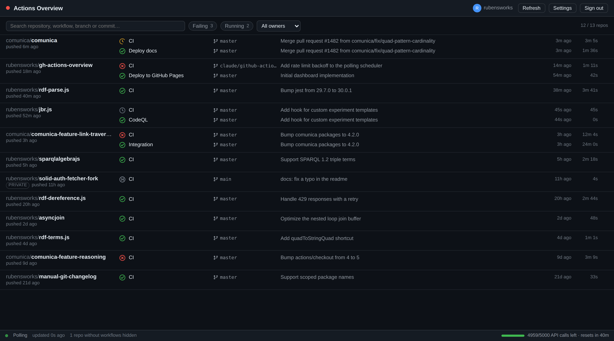
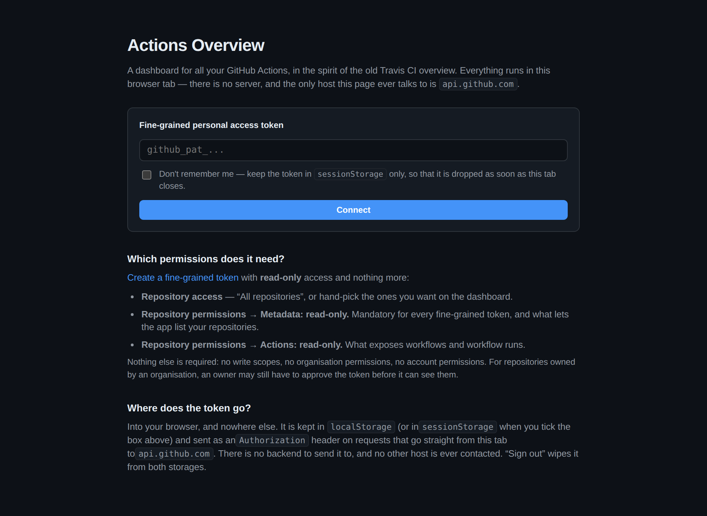
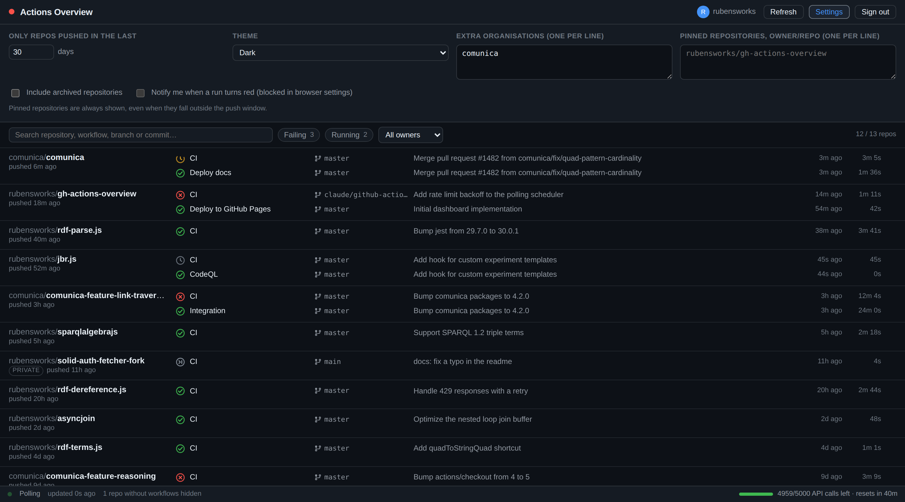

# GitHub Actions Overview

[](https://github.com/rubensworks/gh-actions-overview/actions?query=workflow%3ACI)
[](https://opensource.org/licenses/MIT)

A dashboard for all your GitHub Actions, in the spirit of the old Travis CI overview: one dense row
per repository, the latest run of every workflow, and red where it hurts.

**[→ Open the dashboard](https://rubensworks.github.io/gh-actions-overview/)**



It is a static page. There is no backend, no analytics, and no third-party host: the only server
this app ever talks to is `api.github.com`, straight from your browser.

## Features

- **One row per repository** with the latest run of each workflow: status icon, branch, commit
  message, relative time, duration, and a deep link to the run on github.com.
- **Smart polling.** Repositories with a queued or running workflow refresh every 15 seconds;
  quiet ones every 2–5 minutes, jittered so requests do not arrive in bursts. Polling pauses
  entirely while the tab is hidden.
- **Cheap polling.** Every request is conditional (`If-None-Match`). GitHub answers unchanged data
  with `304 Not Modified`, which does not count against your REST rate limit. The remaining quota
  is always visible in the footer.
- **Filters** for failures, running workflows, owner, and free-text search across repository,
  workflow, branch and commit message. The filter state lives in the URL, so views are bookmarkable.
- **Repository drawer** with the last 10 runs of every workflow.
- **Tab status.** The favicon and page title turn red (and count) when anything is failing, so a
  pinned tab is enough to keep an eye on things.
- **Optional desktop notifications** when a workflow transitions into failure.
- **Dark, light, or follow-the-system** theme.

## Setting up a token

The dashboard needs a GitHub personal access token to read your workflow runs. A **fine-grained**
token with two read-only permissions is enough.

1. Go to [**Settings → Developer settings → Personal access tokens → Fine-grained
   tokens**](https://github.com/settings/personal-access-tokens/new).
2. **Repository access**: either *All repositories*, or hand-pick the ones you want on the
   dashboard.
3. **Repository permissions** — set exactly these two, and nothing else:

   | Permission | Access      | Why                                                       |
   |------------|-------------|-----------------------------------------------------------|
   | Metadata   | Read-only   | Mandatory for every fine-grained token; lists your repos. |
   | Actions    | Read-only   | Exposes workflows and workflow runs.                      |

4. Copy the token and paste it into the setup screen.

No write scopes, no organisation permissions, and no account permissions are needed. For
repositories owned by an organisation, an organisation owner may still have to approve the token
before it becomes usable — until then those repositories simply will not appear.

A classic PAT works too, if you prefer: it needs `repo` for private repositories, or `public_repo`
for public ones only. Fine-grained tokens are strongly recommended, because they can be scoped down
to read-only.



## Security model

The short version: **your token never leaves your browser.**

- The app is a bundle of static files. Once the page has loaded, there is no server involved in
  anything it does — there is nothing to send your token *to*.
- The token is stored in `localStorage` under `gh-actions-overview:token`, or in `sessionStorage`
  when you tick *“Don't remember me”* on the setup screen. `sessionStorage` is wiped as soon as the
  tab closes.
- It is attached as an `Authorization` header on requests issued by your browser directly to
  `https://api.github.com`. No other host is ever contacted; there are no third-party scripts,
  fonts, or trackers on the page.
- **Sign out** removes the token from both storages.

What this model does *not* protect against, so that you can judge it for yourself:

- Anything with access to your browser profile can read `localStorage`. On a shared machine, use
  *“Don't remember me”*.
- A cross-site scripting hole in this app would expose the token. The app renders all GitHub data
  as text through React (never `dangerouslySetInnerHTML`) and loads no third-party code, which is
  what keeps that surface small — but a read-only, narrowly scoped, expiring token is still the
  right thing to paste in.
- If you host your own copy, you are trusting whoever can deploy to that origin. The GitHub Pages
  deployment in this repository is built from `master` by
  [`deploy.yml`](.github/workflows/deploy.yml).

Give the token an expiry date. Revoke it from
[the token settings](https://github.com/settings/tokens?type=beta) whenever you want; the dashboard
will simply ask for a new one.

## Which repositories are shown

By default: every repository you can see that was **pushed to in the last 30 days** and has **at
least one workflow**. Repositories without workflows are counted in the footer and otherwise kept
out of the way.

In **Settings** you can:

- change the push window (any number of days);
- add **organisations**, which pulls in their repositories too;
- **pin** individual `owner/repo` entries, which are always shown regardless of the push window;
- include archived repositories;
- switch the theme and enable failure notifications.

Settings are persisted in `localStorage`; filters are persisted in the URL.



## Rate limits

Authenticated REST requests are limited to 5000 per hour. The dashboard keeps well under that:

- Every response's `ETag` is cached, and every subsequent request is conditional. Unchanged
  resources come back as `304`, which GitHub does not charge against the limit.
- `x-ratelimit-remaining` is read from every response and shown in the footer.
- Below ~300 remaining requests, polling slows down by 5×. Below ~30, it stops until the quota
  resets. A `403`/`429` with `retry-after`, or an exhausted quota, pauses polling and says so in
  the footer.

## Development

```bash
npm install
npm run dev        # Vite dev server
npm run lint       # ESLint, using @rubensworks/eslint-config
npm run build      # Type-check and produce dist/
npm run preview    # Serve the production build
```

Both `npm run lint` and `npm run build` run on every push and pull request via
[`ci.yml`](.github/workflows/ci.yml).

> **Note:** the CI and deployment workflows currently sit in
> [`docs/workflows/`](docs/workflows/) and still have to be moved into `.github/workflows/`. See
> [`docs/workflows/README.md`](docs/workflows/README.md) for why, and for the one command that does
> it.

### Layout

```
src/
  app.tsx                  Session and settings ownership
  components/              Presentational React components
  lib/
    githubClient.ts        Octokit wrapper: conditional requests, rate limit bookkeeping
    dashboardStore.ts      Polling scheduler and state, consumed via useSyncExternalStore
    selectors.ts           Filtering and aggregation
    storage.ts             Token and settings persistence
    urlState.ts            Filter state in the query string
    favicon.ts             Tab title and favicon reflecting overall status
```

The dashboard state lives in a plain TypeScript store rather than in React state. The store runs one
low-frequency ticker, refreshes at most six repositories at a time, and gives each repository its own
refresh deadline based on whether anything is running. React subscribes to it through
`useSyncExternalStore`.

## License

This software is written by [Ruben Taelman](http://rubensworks.net/).

This code is released under the [MIT license](http://opensource.org/licenses/MIT).
